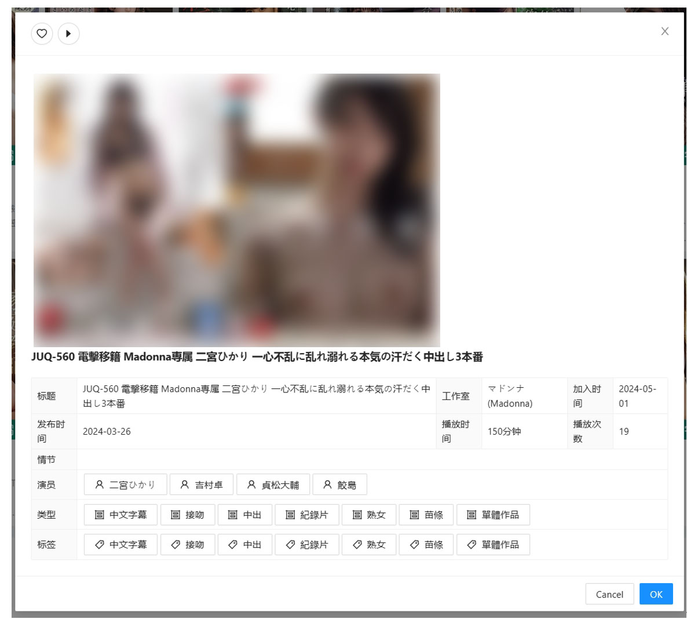
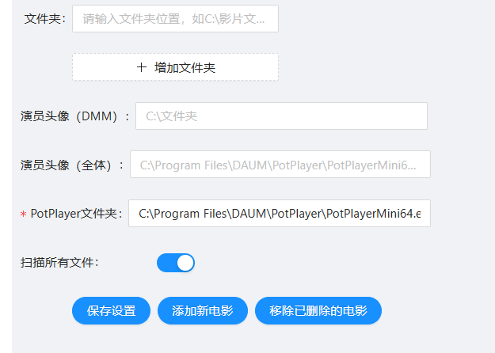
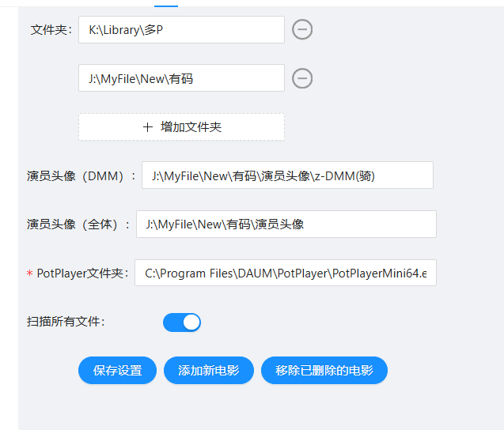

# 软件介绍
所谓工欲善其事必先利其器，如果说拥有一个元数据完备的电影库则是优雅看片的第一步，那么我认为有一个功能功能完备的电影管理器则是优雅看片的第二步。

自从我19，20之际参考@Pockies大佬写的《[利用AV Data Capture+Jellyfin+Kodi打造更优雅的本地AV（毛片）+普通影片媒体库](https://pockies.github.io/2020/01/09/av-data-capture-jellyfin-kodi/)》一文，建立了我的电影库后，我便一直苦于没有一个符合我心目中全部功能的PC端影片管理软件，当时正逢疫情之际，我也得以长期在家办公，于是便心生写一个满足自己想要功能的影音管理器。

从21年动笔，到24年今日的第一版release，作为一款轻量级的软件来说开发周期算是很长的了，其实在软件立项1，2个月后基本功能上就已经成型，但归咎于我前端的不熟练，我便一直懒于完成这个软件的使用周期。在23年chatgpt横空出世后，我便利用它完成了整个软件的loop。

作为一个传统行业出身的码农，我选的后端技术栈是 .NET Core 3.1，前端用的是React.js; UI框架采用的是Ant Design; 数据库采用的是SQL Lite。

软件主要的页面有“影片”， “演员”，其次有类型，标签，导演。我在前两个页面花了比较大的功夫，功能也更加完备。

电影页面如下，基本就是以Ant Design里Card来显示各个影片的缩略图，屏幕导航栏可以根据演员，类型等信息快速filter查找影片。

右侧是影片搜索，加入Potplayer播放列表功能。并且支持自定义SQL搜索。


点击影片卡后即可进入影片详情界面，界面会自动获取演员，类型，标签信息并以Button形式显示在详情界面上，点击button即可查看相关影片。


演员界面如下，目前的演员列表是基于我的电影收藏刮削获得（本人库收藏6000余部，基本囊括热门女优），在本程序里也内置了一个女演员刮削器。演员界面的左侧支持通过年龄，身高，罩杯进行filter，右上方可以将屏幕内所有演员的电影加入Potplayer播放列表，以及人名搜索功能。


点击演员头像卡即可进入演员详情页面，页面里将有演员的各项信息以及评分（评分来源为minnano-av，同时这也是我用于刮削数据的网站）


# 安装说明
影片需要预先通过Movie_Data_Capture等刮削器取得元数据和影片封面图片。如果已有元数据，请直接从第二步开始阅读。
## 第一步：影片刮削
下列步骤使用的刮削器为Movie_Data_Capture。原项目已商业化闭源，采用的是闭源前的版本。下载链接如下：https://github.com/4evergaeul/MovieManager/releases/download/v1/MDC.zip

1.  清理影片名，让影片名的格式为：{番号名}-{序号} 或 {番号名}-{序号}-C。
例如xxxx.com@ADN-566.mp4需要重命名为ADN-566.mp4，否则影片刮削器（下称MDC）无法识别。

2. 重命名完毕后，确认Movie_Data_Capture.exe,config.ini,和将要整理的影片在同一文件夹内。


3. 运行Movie_Data_Capture.exe,程序运行完毕后，影片将按照女优名分类放入JAV_output文件夹中。

4. 数据清理：不知道是不是JavDB数据的原因，刮削完成的数据(.nfo文件)有一些杂质，如下图

此时需要清理一下，推荐使用VisualStudio Code。使用Visual Studio Code，打开JAV_output文件夹。

4.1 按住Ctrl+Shift+H打开批量修改面板，搜索"<![CDATA["，然后点击"replace all"

4.2.之后再输入“]]>”，然后再点击"replace all"。
4.3.再输入"分鐘"（清理nfo里runtime里的数据），然后点击"replace all"。至此，数据应该全部清洗完毕。

5. 运行[男优刮削器](https://github.com/4evergaeul/AVDanyuScrapper)（AvdanyuScraper.exe，可选），选择JAV_output文件夹，等待刮削结束。

此时数据整理完毕，之后可以把处理过后的文件夹全部移动到你的影片库位置。

## 第二步：安装软件
1. 下载安装[.NET SDK](https://download.visualstudio.microsoft.com/download/pr/b70ad520-0e60-43f5-aee2-d3965094a40d/667c122b3736dcbfa1beff08092dbfc3/dotnet-sdk-3.1.426-win-x64.exe), [Node.js](https://nodejs.org/dist/v20.15.0/node-v20.15.0-x64.msi), [Potplayer](https://t1.daumcdn.net/potplayer/PotPlayer/Version/Latest/PotPlayerSetup64.exe)

2. 运行dotnet-sdk-3.1.426-win-x64.exe，并完成安装。这个是.NET Core 3.1的SDK，也将用于该程序的后端。

3. 打开cmd，运行如下
```
npm install --global serve
npm install --global http-server
```

4. 安装PotPlayerSetup6,建议使用默认安装位置 ```C:\Program Files\``` 以便之后无需重新在软件内配置。

5.  在一切安装完毕后，即可以解压MovieManager。双击"MovieManager.TrayApp.exe"运行。

6. 这时程序会出现在<b>屏幕右下角的托盘图标中</b>，如下图。


7. 右键图标，点击"打开"。这个时候默认浏览器会打开影片管理器。点击<b>设置</b>。


8.  下面是设置表格的介绍：
<b>（必须）</b> “文件夹”： 设置为你的影片目录（需要手动输入，或把地址复制粘贴过去）。e.g.``` J:\MyFile\New\有码\演员```。
演员头像库请参考：https://github.com/gfriends/gfriends
<b>（可选）</b> “演员头像（DMM）”将用于演员页面的演员大头照。放文件夹地址。
<b>（可选）</b>“演员头像（全体）”用于演员详细页面里的写真照片。放文件夹地址。
“扫描多少天内添加的电影”，如果这里的数值设为-1，则搜索所有电影。


10. 在一切配置完成后，点击“保存设置”->“添加新电影”。 程序就会开始构建影片库，这个时长会根据你影片数量而定。影片库构建完成后页面会刷新并返回电影页面。（如果点击保存设置后，程序未能立刻保存，说明后端程序没有正常运行，右键点击托盘栏图标并点击退出，重新运行程序即可）

配置完成后类似下图。



# Repository文档
### 文件树
```
MovieManager
│
├───MovieManager.BusinessLogic： 后端逻辑
│
├───MovieManager.ClassLibrary： ViewClass
│
├───MovieManager.Data：数据库交互层
│
├───MovieManager.DB：数据库文件
│
├───MovieManager.Deployment：用于自动部署，build的executable可在./MovieManager.TrayApp/bin/Any CPU找到
│
├───MovieManager.Endpoint： API文件
│
├───MovieManager.Testing： Unit Testing文件
│
├───MovieManager.TrayApp： 程序Startup逻辑
│
└───MovieManager.Web： 前端逻辑
```

### 参数
参数位于appsettings.json文件内。下面是各个参数的解释：
- WebAppDirectory：R放置eact的生成文件的文件夹。
- EndpointHost：后端API的端口，如果要更改为其他则需要更改并重新build前端项目。
- HttpServerStartPort：HttpServer是一个Node组件，用于映射本地的文件夹到一个ip地址，以用于前端文件访问本地媒体文件。这个端口用于设置起始的盘符端口（A盘对应8100，B盘对应8101，C盘对应8102，以此类推）。更改此端口不需要重新部署项目。

### Loggings
项目使用的时Serilog的loggings库，log文件build的文件夹下。

# Road Map
* Display movie/actor cards amount based on screen size
* Genre result one-click add to playlist
* Tag result one-click add to playlist
* Director search
* Actor/Movie card add JabDb/Jable url
